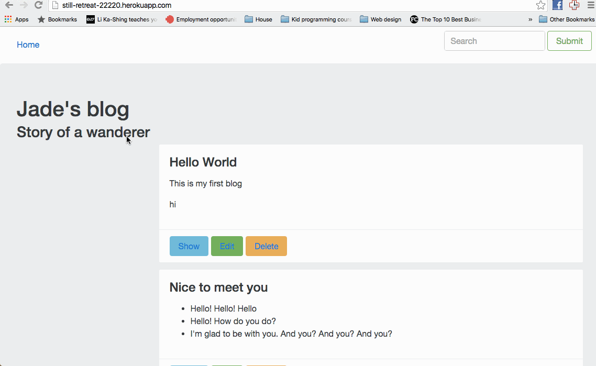

# Pre-work - *Jade Blog*

**Jade blog** is a Ruby on Rails blog application.

Submitted by: **Jade Le**

Time spent: **25** hours spent in total

URL: **still-retreat-22220.herokuapp.com**

## User Stories

The following **required** functionality is complete:

> HINT: mark the items you completed with [x]

* [ X] User can create a new post, formatted using the Markdown language.
* [X ] User can edit an existing post.
* [X ] There is one post that introduces the App Creator with name, picture.
* [ X] User can delete stories, with an alert that asks the user to confirm.
* [X ] User see a search form on the Posts page.
* [X ] User can submit a search term to find all posts bywith titles containing the search term.

The following **optional** features are implemented:
* [ X] There is a "navbar" that is responsive to window size similar to http://v4-alpha.getbootstrap.com/examples/navbar/. 
* [X ] User can see how many views a post has. 
* [X ] User can leave a comment on a post.
* [X ] User can add "tags" to a post, and filter posts by tag. 

## Video Walkthrough 

Here's a walkthrough of implemented user stories:

GIF created with [LiceCap](http://www.cockos.com/licecap/).
